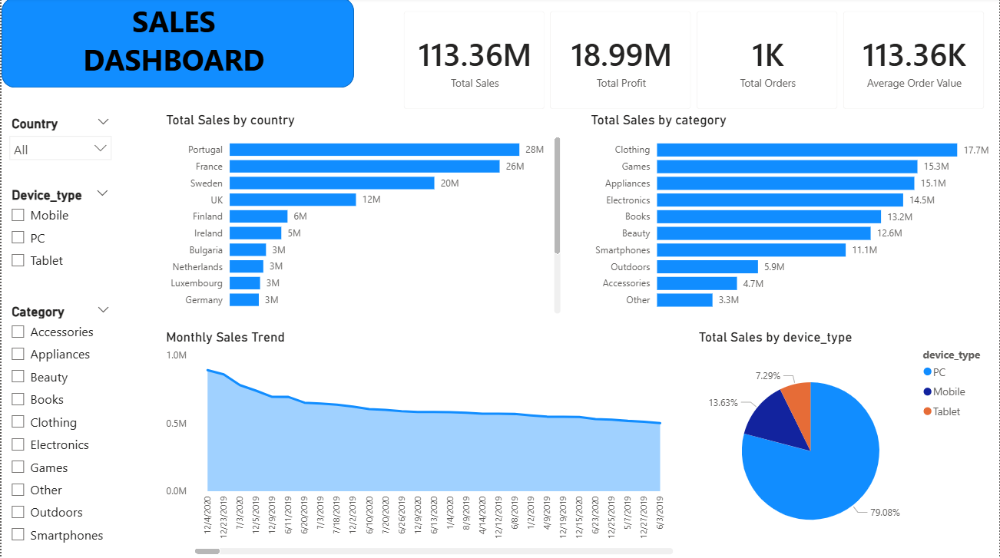

# Sales Dashboard Project

This project was created using Power BI to analyze sales data from 2019 to 2020. The dashboard helps understand sales performance, category trends, customer purchase patterns, and device-based sales insights.

## What I Did
- Cleaned and organized the dataset
- Created KPI cards for sales, profit, orders, and average order value
- Built interactive filters for better analysis
- Designed charts to compare country-wise and category-wise sales
- Added a monthly sales trend visualization
- Created a device type sales distribution chart

## Dashboard Highlights
- Portugal showed the highest overall sales
- Clothing and Games categories performed well
- Most orders were placed using PC devices
- The dashboard allows interactive filtering by country, category, and device type

## Tools Used
- Power BI
- CSV Dataset

## Files Included
- Power BI Dashboard (.pbix)
- Dataset (.csv)
- Dashboard Screenshot
- README.md

## Learning Outcome
This project helped me improve my skills in data visualization, dashboard design, DAX measures, and business insight generation using Power BI.

